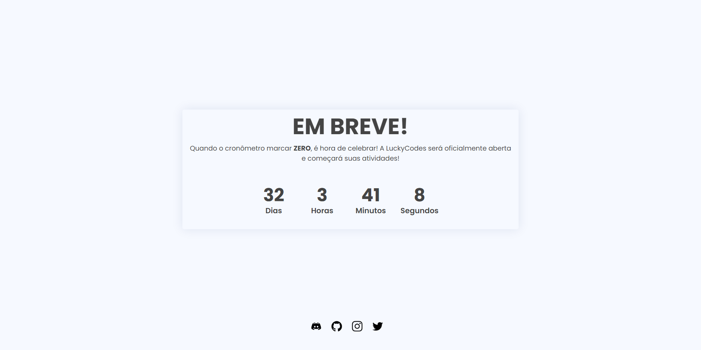

# EmBreve Front

### Acesse o projeto clicando <a href="https://LuckyCodes-App.github.io/EmBreve/index.html" target="_blank"> aqui</a>

## 🚀 Instalando EmBreve

Para instalar o EmBreve, siga estas etapas:

* Clique em `Code`;
* Clique em `Download ZIP`;
* Extraia o projeto.

## ☕ Usando EmBreve

Para usar EmBreve, siga estas etapas:

* Abra o arquivo `index.html`;
* Edite as redes sociais e o header;
* Abra o arquivo `script.js`;
* Edite a data de lançamento.

## 📫 Contribuindo para EmBreve
Para contribuir com EmBreve, siga estas etapas:

1. Bifurque este repositório.
2. Crie um branch: `git checkout -b <nome_branch>`.
3. Faça suas alterações e confirme-as: `git commit -m '<mensagem_commit>'`
4. Envie para o branch original: `git push origin EmBreve / <local>`
5. Crie a solicitação de pull.

Como alternativa, consulte a documentação do GitHub em [como criar uma solicitação pull](https://help.github.com/en/github/collaborating-with-issues-and-pull-requests/creating-a-pull-request).
